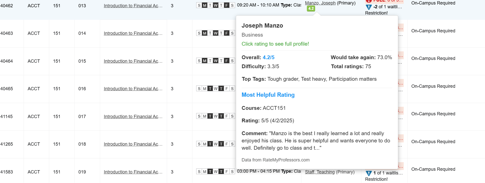
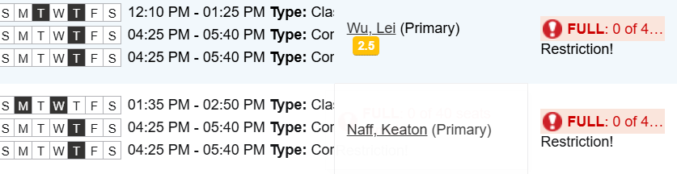

# VTAddDropHelper

Chrome extension showing Rate My Professor information in Virginia Tech's Add/Drop system.

Originally made by Harrison Keen @ Lehigh University, adapted for Virginia Tech.

## Features

- **Professor Ratings**: Displays professor ratings directly in Add/Drop.
- **Interactive Tooltips**: Hover over professor scores to see detailed information, including average ratings, difficulty scores, top tags, the most helpful review, and a direct link to the professor's full profile.
  
Please verify all professor information before making final course selections. While I strived for accuracy, rating data may contain errors or be outdated. Users are responsible for confirming their course schedules

## Stack

The extension uses two JavaScript files to integrate RateMyProfessors data into Virginia Tech's course registration system. The background script fetches data from RateMyProfessors.com's GraphQL API to bypass CORS restrictions and handles professor name matching across different formats. The content script scans course pages for instructor information and creates interactive rating badges with tooltips that display professor ratings, difficulty, and reviews. The system automatically detects new course content and provides real-time rating integration without page reloads.

## Screenshots

The extension adds the average rating below the professor's name. Hovering over the name brings up a tooltip with more information and a link to the professor's RateMyProfessor page.

If a professor is not found, the name (Naff, Keaton) is displayed as normal.

## Privacy Policy

This extension does not collect, store, or transmit any personal user data.

The extension makes requests to RateMyProfessors.com's GraphQL API to fetch professor ratings and reviews. All data is processed locally in your browser and is not stored beyond your current browsing session. The extension only requests the minimum permissions needed to function - access to Plan Ahead pages and the RateMyProfessors API.

## Other

If you'd like to adapt this extension for use with your university's schedule builder, you'll need to change the school ID to your school's RateMyProfessor ID. This was done through Lehigh's Self-Service-Banner (SSB) system, if you use another application such as DraftMySchedule or unique course portals I urge you to look into WesternRMP or YorkURMP respectively (both can be found on github) or adapt as you see fit.
